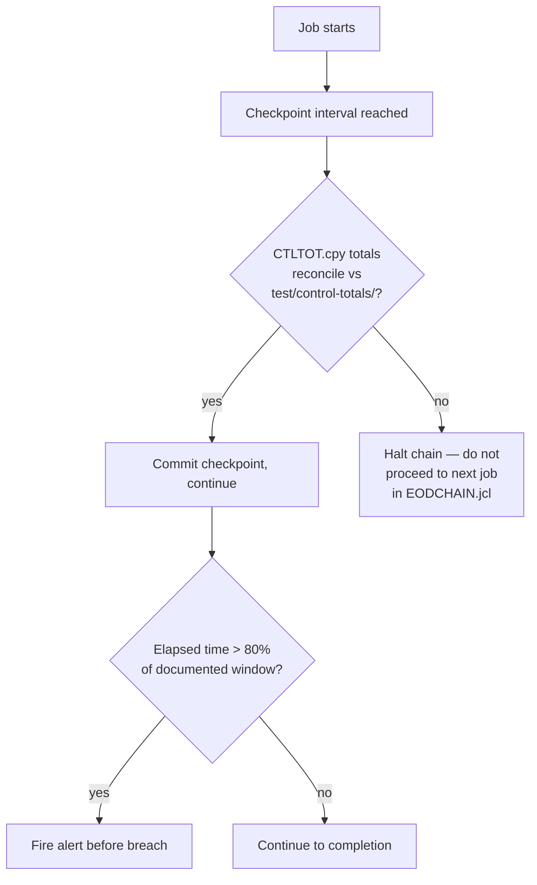

<!--
SYNC IMPACT REPORT
Version change: N/A → 1.0.0 (initial ratification)
Principles added: Every Job Runs Within Its Batch Window; Balance and Control Totals Are the
  Source of Truth; Checkpoint/Restart Is Mandatory for Long-Running Jobs; Copybooks Are
  Change-Controlled Shared Infrastructure; Reruns Are Idempotent by Design; No Dynamic SQL,
  No Ambiguous Numeric Handling; Every Abend Has a Documented, Tested Recovery Procedure
Templates requiring updates: plan-template.md ✅ · tasks-template.md ✅ · spec-template.md ✅
Follow-up TODOs: none
-->

# EOD-Settle Constitution

> This constitution assumes an org-level "Section 0" (bank-wide security, compliance, and
> audit non-negotiables) is prepended per the organization's constitution-sync process.
> What follows is this repository's layer, written to be actionable by an AI coding
> assistant working directly in this codebase — every rule below points at a real member.

**Repository:** EOD-Settle (end-of-day settlement and reconciliation batch suite)
**Stack:** COBOL, z/OS, JCL-scheduled · **Tier:** 1 — Critical / Complex

---

## Repository Structure

```
eod-settle/
├── cobol/
│   ├── batch/
│   │   ├── EOD100.cbl                # Job 1: transaction extract & validation
│   │   ├── EOD200.cbl                # Job 2: ledger posting — checkpoint reference pattern
│   │   └── EOD300.cbl                # Job 3: settlement reconciliation
│   └── copy/                         # Shared copybooks — change-controlled, see Principle IV
│       ├── ACCTREC.cpy               # Account record layout
│       ├── TXNREC.cpy                # Transaction record layout; carries the transaction-ID
│       │                             #   field used for idempotency (Principle V)
│       └── CTLTOT.cpy                # Control-total record layout, shared by every job
├── jcl/
│   ├── EODCHAIN.jcl                  # Master job chain — defines dependency order & window alerts
│   ├── EOD100.jcl
│   ├── EOD200.jcl                    # Checkpoint dataset declaration lives here
│   └── EOD300.jcl
├── db2/
│   └── ddl/                          # Static SQL DDL — no dynamic SQL, see Principle VI
├── runbooks/
│   ├── EOD100-recovery.md            # Required before EOD100 may be scheduled — Principle VII
│   ├── EOD200-recovery.md
│   └── EOD300-recovery.md
└── test/
    ├── parallel-run/                 # Prior-version output baselines for diffing
    │   └── EOD200-baseline.dat
    └── control-totals/               # Expected control-total fixtures per job
        └── EOD200-expected.txt
```

---

## Core Principles

### I. Every Job Runs Within Its Batch Window, With No Exceptions Silently Accepted
`jcl/EODCHAIN.jcl` defines the dependency order and expected runtime per job. A job MUST
report elapsed time at each checkpoint; if `EOD100`, `EOD200`, or `EOD300` trends past 80% of
its documented window, the alert wired in `EODCHAIN.jcl` MUST fire before the window would
actually breach. No job may be resubmitted outside the order defined in `EODCHAIN.jcl`
without a change record, regardless of urgency.

**Rationale:** A blown batch window means online banking doesn't open on time the next
business day — the highest-consequence, and most preventable, failure mode in this system.

### II. Balance and Control Totals Are the Source of Truth, Not the Log
Every job in `cobol/batch/` MUST populate the fields defined in `cobol/copy/CTLTOT.cpy`
(record count, hash total, monetary total) and compare them against the expected values in
`test/control-totals/` before signaling completion to `jcl/EODCHAIN.jcl`. A mismatch MUST
set a non-zero return code that halts the chain — it MUST NOT be logged as a warning while
the job reports success.

**Rationale:** A job that "completed successfully" in the log but does not balance did not
actually complete — the control totals are the audit record here, not the log.

### III. Checkpoint/Restart Is Mandatory for Any Long-Running Job
Any job in `cobol/batch/` above its documented per-job record-count threshold MUST implement
checkpoint logic against the checkpoint dataset declared in its JCL — `jcl/EOD200.jcl` is the
reference pattern to follow. A restarted job MUST resume from its last committed checkpoint;
rerun-from-start is permitted only where the matching file in `runbooks/` explicitly
documents it as the procedure for that job.

**Rationale:** Rerunning a multi-hour job from scratch after a late-window failure is often
not possible within the remaining window — checkpoint/restart is what makes recovery
survivable rather than theoretical.

### IV. Copybooks Are Change-Controlled Shared Infrastructure
Any change to `cobol/copy/ACCTREC.cpy`, `TXNREC.cpy`, or `CTLTOT.cpy` MUST list every
program in `cobol/batch/` that includes it, attached to the change record. Every listed
program MUST be recompiled and pass parallel-run validation against `test/parallel-run/`
before the copybook change ships. A field MUST NOT be resized, retyped, or reordered without
this — no exceptions for "the change only affects one program."

**Rationale:** A copybook layout change is one of the most common causes of a multi-program
batch outage precisely because its blast radius is invisible in the diff and only visible in
the dependency graph.

### V. Reruns Are Idempotent by Design
Every program in `cobol/batch/` MUST check the transaction-ID field defined in
`cobol/copy/TXNREC.cpy` against already-posted transactions before writing a ledger entry.
A rerun against the same input file MUST NOT create a second posting for a transaction ID
already present in the ledger.

**Rationale:** Batch operators will rerun jobs under pressure at 3 a.m.; the system has to
be safe under that reality, not just under the conditions it was tested against.

### VI. No Dynamic SQL, No Ambiguous Numeric Handling
All DB2 access MUST use static SQL defined against `db2/ddl/` and precompiled at build time.
Numeric fields in `cobol/copy/*.cpy` MUST match their consuming program's `WORKING-STORAGE`
definitions exactly — a mismatch caught in review blocks merge; it is not deferred to
testing.

**Rationale:** Dynamic SQL in batch financial processing is a performance and
injection-adjacent risk; copybook/program numeric mismatches are a classic, hard-to-detect
source of silent monetary rounding or truncation errors.

### VII. Every Abend Has a Documented, Tested Recovery Procedure
Every job in `cobol/batch/` MUST have a matching file in `runbooks/` (e.g.,
`EOD100-recovery.md`) covering its most likely abend codes before it is added to
`jcl/EODCHAIN.jcl` for production scheduling. A job without a matching runbook MUST NOT go
live.

**Rationale:** The person on call at 2 a.m. is frequently not the person who wrote the job —
recovery has to be executable from the runbook alone.

---

## Additional Constraints & Standards

| Area | Constraint | Where |
|---|---|---|
| Platform | z/OS, JCL-scheduled | `jcl/` |
| Data sets | VSAM/sequential, copybook-defined layouts | `cobol/copy/` |
| Character encoding | EBCDIC internal; explicit conversion at any Unicode boundary | job-specific programs in `cobol/batch/` |
| SQL access | Static/precompiled DB2 only | `db2/ddl/` |
| Audit trail | Full job-run history and control totals retained per regulatory policy | `test/control-totals/`, job logs |

---

## Development Workflow & Quality Gates



Required before any batch change ships to production:

```
# Submit the job chain to the test region
SUBMIT jcl/EODCHAIN.jcl (TEST)

# Diff new output against the prior-version baseline
compare test/parallel-run/EOD200-baseline.dat  OUTPUT.EOD200.NEW

# Verify control totals reconcile
compare test/control-totals/EOD200-expected.txt  CTLTOT.EOD200.OUT
```

- **Copybook changes** trigger full dependent-program regression per Principle IV — not just
  the program that motivated the change.
- **Change freeze:** no batch logic changes during month-end/quarter-end close, except
  emergency fixes under incident change-control.
- **Sign-off chain:** developer → peer review → production-control, before any
  `jcl/EODCHAIN.jcl` change goes live.

---

## Governance

- **Amendment procedure:** proposed via PR against this file, run through
  `/speckit.constitution`. Changes to Principles II, III, or V additionally require
  production-control and audit sign-off.
- **Versioning policy:** semantic (MAJOR.MINOR.PATCH).
- **Compliance review:** aligned to the audit cycle, plus mandatory review after any abend or
  reconciliation-break postmortem.
- Hand-editing this file outside `/speckit.constitution` is treated as an undocumented
  change to a production recovery procedure.

**Version**: 1.0.0 | **Ratified**: [date] | **Last Amended**: [date]
