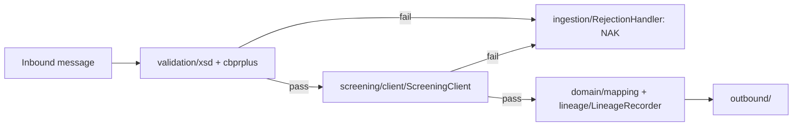

<!--
SYNC IMPACT REPORT
Version change: N/A → 1.0.0 (initial ratification)
Principles added: Schema Validation Rejects, Never Repairs; Every Transformation Is
  Idempotent and Traceable; MT Compatibility Is a Bounded Legacy Concern; CBPR+ Compliance Is
  Verified, Not Assumed; Structured Address Data Is Enforced at the Boundary; Sanctions
  Screening Cannot Be Bypassed; Message Versioning Is Explicit, Never Inferred
Templates requiring updates: plan-template.md ✅ · tasks-template.md ✅ · spec-template.md ✅
Follow-up TODOs: confirm current CBPR+ usage-guideline version and structured-address
  effective date per message type at each quarterly review
-->

# PayBridge Constitution

> This constitution assumes an org-level "Section 0" (bank-wide security, compliance, and
> audit non-negotiables) is prepended per the organization's constitution-sync process.
> What follows is this repository's layer, written to be actionable by an AI coding
> assistant working directly in this codebase — every rule below points at a real package.

**Repository:** PayBridge (ISO 20022 message translation microservice)
**Stack:** Java / Spring Boot · **Tier:** 1 — Critical / Complex

---

## Repository Structure

```
paybridge/
├── src/main/java/com/bank/paybridge/
│   ├── ingestion/                    # Inbound adapters; wires validation → screening → mapping
│   │   └── RejectionHandler.java     # Structured NAK on any validation failure — Principle I
│   ├── validation/
│   │   ├── xsd/                      # XSD structural validators, one per message type
│   │   └── cbprplus/
│   │       ├── AddressValidator.java # Structured/hybrid address enforcement — Principle V
│   │       └── ...                   # One CBPR+ usage-guideline validator per message type
│   ├── legacy/
│   │   └── mtadapter/                # ALL MT handling lives here — nothing outside may import it
│   ├── domain/
│   │   ├── model/                    # Canonical internal message representation — MX-shaped only
│   │   └── mapping/                  # One mapper per message-type pair
│   ├── screening/
│   │   └── client/
│   │       └── ScreeningClient.java  # The only permitted screening call site — Principle VI
│   ├── lineage/
│   │   └── LineageRecorder.java      # Every mapper MUST call this before returning — Principle II
│   └── outbound/                     # Per-network outbound adapters
├── src/main/resources/
│   ├── schemas/
│   │   └── {sr-year}/                # XSD schemas, one directory per pinned Swift SR year
│   └── application.yml               # paybridge.cbpr-plus.version and per-type SR pins live here
├── src/test/resources/
│   └── golden-messages/              # Known-good sample messages per type
└── src/test/java/.../contract/
    └── SchemaVersionConsistencyTest.java   # Fails build if application.yml drifts from schemas/
```

---

## Core Principles

### I. Schema Validation Rejects, Never Repairs
Every inbound message MUST pass `validation/xsd/` and then `validation/cbprplus/` before
reaching `domain/mapping/`. A message failing either MUST be rejected by
`ingestion/RejectionHandler.java` with a structured NAK. It MUST NOT reach `domain/mapping/`
with defaulted or missing required fields under any circumstance.

**Rationale:** Silently repairing a malformed payment message is how bad data enters the
payment rail; a repaired message is an unaudited guess wearing a valid message's shape.

### II. Every Transformation Is Idempotent and Traceable
Every mapper in `domain/mapping/` MUST call `lineage/LineageRecorder.recordTransformation(...)`
before returning, logging source ID, target ID, and field-level lineage.
`ingestion/` MUST check an incoming message ID against the lineage store before processing —
a duplicate ID short-circuits to the previously recorded result, it does not reprocess.

**Rationale:** A duplicate payment instruction is a financial and regulatory event, and a
disputed-payment investigation depends entirely on this lineage already existing.

### III. MT Compatibility Is a Bounded Legacy Concern, Not a Permanent Feature
Swift ended the MT/MX coexistence period for cross-border payment instructions on
22 November 2025; MX is now the sole standard for in-scope flows. All MT handling MUST live
entirely inside `legacy/mtadapter/`. No class outside that package may import from it, and
`domain/model/` MUST remain MX-shaped only — `legacy/mtadapter/` translates MT into the
canonical model before anything else in the service sees it.

**Rationale:** Treating MT as a permanent, first-class concern recreates the technical debt
the industry migration was meant to retire; isolating it keeps the exit clean as remaining
corridors migrate.

### IV. CBPR+ Compliance Is Verified, Not Assumed
The active CBPR+ usage-guideline version MUST be declared in `application.yml` under
`paybridge.cbpr-plus.version` and MUST match a validator set present in
`validation/cbprplus/`. Bumping the declared version without a matching validator update
MUST fail the build via `SchemaVersionConsistencyTest`.

**Rationale:** CBPR+ guidelines are stricter than the base schema and move on Swift's annual
release cadence; drifting from the pinned version is a common cause of network-level
rejections downstream of this service.

### V. Structured Address Data Is Enforced at the Boundary
`validation/cbprplus/AddressValidator.java` MUST enforce structured — or, where a
transitional hybrid format is explicitly permitted for that message type — address data for
debtor and creditor parties. A message with an unstructured address past its effective date
MUST reject at `validation/`, not pass through for a mapper in `domain/mapping/` to silently
drop the extra text.

**Rationale:** This is a hard compliance deadline with real rejection consequences on the
wire; catching it here is cheaper than a payment bouncing back from the network.

### VI. Sanctions and Compliance Screening Cannot Be Bypassed
Every message reaching `outbound/` MUST have passed through
`screening/client/ScreeningClient.java` first, wired directly into the `ingestion/`
pipeline. No class outside `screening/client/` may implement screening logic — not even
for "test-only" or internal traffic.

**Rationale:** Screening is a regulated control owned by a separate system of record; any
bypass creates an unmonitored path for a sanctioned transaction.

### VII. Message Versioning Is Explicit, Never Inferred
Schema and SR-year versions live in `src/main/resources/schemas/{sr-year}/` and are
declared per message type in `application.yml`. The service MUST NOT contain logic that
inspects message content to guess which `{sr-year}` directory to validate against.

**Rationale:** ISO 20022 schemas carry backward-incompatible changes between SR years;
guessing a version is how a well-formed message from the wrong year gets silently
misparsed instead of cleanly rejected.

---

## Additional Constraints & Standards

| Area | Constraint | Where |
|---|---|---|
| Message types in scope | pacs.008, pacs.009, pacs.002, pain.001, camt.052/053/054, camt.105/106 | `resources/schemas/{sr-year}/` |
| Schema source | Official ISO 20022 XSD registry, version-pinned | `resources/schemas/{sr-year}/` |
| BIC / IBAN validation | Canonical bank library only, no local reimplementation | `validation/xsd/` |
| Currency codes | ISO 4217 only | `validation/xsd/` |
| Transport security | Mutual TLS; message signing where mandated | `ingestion/`, `outbound/` |
| Audit retention | Full lineage retained per regulatory policy | `lineage/LineageRecorder.java` |

---

## Development Workflow & Quality Gates



Required before any PR merges:

```bash
mvn test -Dtest=*ContractTest
mvn test -Dtest=*GoldenMessageTest
mvn test -Dtest=SchemaVersionConsistencyTest
```

- **Golden messages:** no deploy without `src/test/resources/golden-messages/` passing
  against the pinned schema for every in-scope type.
- **SME sign-off:** any change under `domain/mapping/` requires payments-domain SME review
  in addition to standard code review.
- **Rollout:** changes to `validation/` or `domain/mapping/` ship via canary or shadow
  traffic before full cutover.

---

## Governance

- **Amendment procedure:** proposed via PR against this file, run through
  `/speckit.constitution`. Changes to Principles III, IV, V, or VI additionally require
  payments-compliance sign-off.
- **Versioning policy:** semantic (MAJOR.MINOR.PATCH).
- **Compliance review:** aligned to the annual Swift Standards Release cycle, plus ad hoc on
  any newly published migration deadline.
- Hand-editing this file outside `/speckit.constitution` is treated as an undocumented
  compliance-relevant change.

**Version**: 1.0.0 | **Ratified**: [date] | **Last Amended**: [date]
