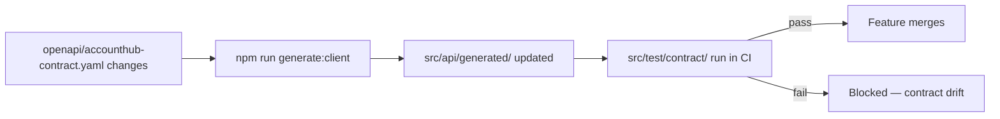

<!--
SYNC IMPACT REPORT
Version change: N/A → 1.0.0 (initial ratification)
Principles added: Accessibility Is Non-Negotiable; No Sensitive Data Persists in the Browser;
  Design System Compliance Over Ad-Hoc Styling; Performance Budgets Are Enforced, Not
  Aspirational; Every API Call Handles Failure Explicitly; Contract-Driven Integration With
  Backend Services
Templates requiring updates: plan-template.md ✅ · tasks-template.md ✅ · spec-template.md ✅
Follow-up TODOs: none
-->

# AccountHub Constitution

> This constitution assumes an org-level "Section 0" (bank-wide security, compliance, and
> audit non-negotiables) is prepended per the organization's constitution-sync process.
> What follows is this repository's layer, written to be actionable by an AI coding
> assistant working directly in this codebase — every rule below points at a real path.

**Repository:** AccountHub (customer-facing digital banking web application)
**Stack:** React + TypeScript · **Tier:** 1 — Critical / Complex

---

## Repository Structure

```
accounthub/
├── src/
│   ├── app/                        # Route-level pages
│   │   ├── dashboard/
│   │   ├── transfer/                # Money-movement flow — see Principle V
│   │   ├── billpay/                 # Money-movement flow — see Principle V
│   │   └── statements/
│   ├── components/                  # Shared, reusable UI — MUST consume design-system/
│   │   ├── Button/
│   │   ├── AccountCard/
│   │   └── TransactionStatus/       # Explicit failure-state component — see Principle V
│   ├── design-system/
│   │   ├── tokens/                  # Color, spacing, typography — single source of truth
│   │   └── primitives/              # Low-level styled primitives; components build on these
│   ├── api/
│   │   ├── generated/               # Auto-generated client — DO NOT hand-edit, see Principle VI
│   │   └── hooks/                   # Data-fetching hooks wrapping the generated client
│   ├── state/
│   │   └── session.ts               # Session lifecycle, incl. clearOnLogout — see Principle II
│   ├── i18n/
│   │   └── locales/                 # All user-facing strings live here, not inline
│   ├── analytics/
│   │   └── events.ts                # Central event definitions; PII scrubbing enforced here
│   └── test/
│       ├── unit/
│       │   └── a11y/                # Automated accessibility checks
│       ├── contract/                # Contract tests against openapi/accounthub-contract.yaml
│       └── e2e/                     # Playwright specs for critical flows
├── openapi/
│   └── accounthub-contract.yaml     # Source of truth backend contract; generated/ is derived from this
├── budgets.json                     # Per-route bundle-size and Core Web Vitals budgets
└── package.json                     # browserslist config lives here
```

---

## Core Principles

### I. Accessibility Is Non-Negotiable, Not a Backlog Item
Every new component under `src/components/` or page under `src/app/` MUST pass `npm run
test:a11y` (axe-core, run against `src/test/unit/a11y/`) plus one manual keyboard-only pass
before merge. Color contrast, focus order, and screen-reader labeling MUST meet WCAG 2.2 AA.
A component that fails `test:a11y` does not merge — the fix is not filed as a follow-up.

**Rationale:** Retrofitting accessibility after launch is exponentially more expensive, and
banking UIs routinely carry legal accessibility obligations.

### II. No Sensitive Data Persists in the Browser
Session tokens MUST be set as httpOnly, secure, `SameSite` cookies by the backend — nothing
in `src/state/` or `src/api/` may write a token to `localStorage` or `sessionStorage`.
Account numbers, balances, or other PII MUST NOT appear in `src/analytics/events.ts`
payloads or any logger call. `src/state/session.ts` MUST clear cached account data via its
`clearOnLogout` hook on every session end — this is the one place that guarantee is allowed
to live.

**Rationale:** Browser storage and analytics pipelines are common exfiltration vectors; this
makes that class of bug structurally impossible rather than merely discouraged.

### III. Design System Compliance Over Ad-Hoc Styling
All UI MUST import primitives from `src/design-system/primitives/` and tokens from
`src/design-system/tokens/`. A new visual pattern MUST be added to `src/design-system/`
first, before it's used anywhere in `src/components/` or `src/app/`. Inline styles or
one-off overrides on anything imported from `src/design-system/` are prohibited — extend
the token set instead of overriding around it.

**Rationale:** The design system is the single source of truth for appearance and behavior;
bypassing it creates drift that compounds with every release and multiplies the a11y
surface area covered by Principle I.

### IV. Performance Budgets Are Enforced, Not Aspirational
Each route under `src/app/*` MUST stay under its budget declared in `budgets.json` at the
repo root, and MUST meet the Core Web Vitals thresholds `npm run test:perf` checks in CI. A
PR that regresses an entry in `budgets.json` MUST include an explicit justification in the
PR description, or CI blocks the merge.

**Rationale:** Customers routinely use this app on constrained mobile connections;
performance is a trust and retention issue here, not polish.

### V. Every API Call Handles Failure Explicitly
Every hook in `src/api/hooks/` MUST return a paired `error`/`isLoading` value alongside
`data` — a hook that returns bare `data` fails review. Money-movement flows
(`src/app/transfer/`, `src/app/billpay/`) MUST render `src/components/TransactionStatus/`
on failure, showing an explicit, unambiguous outcome — never a silent automatic retry that
risks a double-submission.

**Rationale:** An ambiguous failure state on a money-movement action is a support and fraud
risk, not a rough UX edge.

### VI. Contract-Driven Integration With Backend Services
This app MUST consume backend data only through `src/api/generated/`, produced from
`openapi/accounthub-contract.yaml` via `npm run generate:client`. Nothing under
`src/api/generated/` is hand-edited, ever — a needed change starts at the `.yaml` contract
and flows through regeneration. Contract tests in `src/test/contract/` MUST pass against the
pinned schema before merge.

**Rationale:** This app is one of many consumers of shared banking services; contract drift
between frontend and backend is a leading cause of production incidents, and it's entirely
preventable at this boundary.

---

## Additional Constraints & Standards

| Area | Constraint | Where |
|---|---|---|
| Framework | React + TypeScript, versions pinned | `package.json`, lockfile |
| Browser support | Documented evergreen matrix | `browserslist` field in `package.json` |
| Accessibility | WCAG 2.2 AA, axe-core in CI | `src/test/unit/a11y/` |
| State management | One approved library only | `src/state/` |
| Styling | Tokens + primitives only | `src/design-system/` |
| i18n | No hardcoded UI strings | `src/i18n/locales/` |
| Testing | Unit, contract, e2e | `src/test/unit/`, `src/test/contract/`, `src/test/e2e/` |
| Analytics | PII scrubbing verified before shipping an event | `src/analytics/events.ts` |

---

## Development Workflow & Quality Gates



Required before any PR merges:

```bash
npm run lint
npm run test:unit
npm run test:contract
npm run test:a11y
npm run test:perf              # checked against budgets.json
npm run test:e2e -- --grep "critical"
```

- **Feature flags:** any change touching `src/app/transfer/` or `src/app/billpay/` ships
  behind a flag with staged rollout — no direct-to-100% release.
- **Review:** one peer reviewer minimum; a new addition to `src/design-system/` additionally
  requires design-system owner sign-off.
- **Definition of done:** `test:a11y` passing · `budgets.json` respected · error/loading/empty
  states present in the touched hook · `test:contract` passing · peer-reviewed.

---

## Governance

- **Amendment procedure:** proposed via PR against this file, run through
  `/speckit.constitution`. Changes to Principle II or VI additionally require security or
  platform-architecture sign-off.
- **Versioning policy:** semantic (MAJOR.MINOR.PATCH).
- **Compliance review:** each release train, or monthly at minimum.
- Hand-editing this file outside `/speckit.constitution` is a workflow violation.

**Version**: 1.0.0 | **Ratified**: [date] | **Last Amended**: [date]
