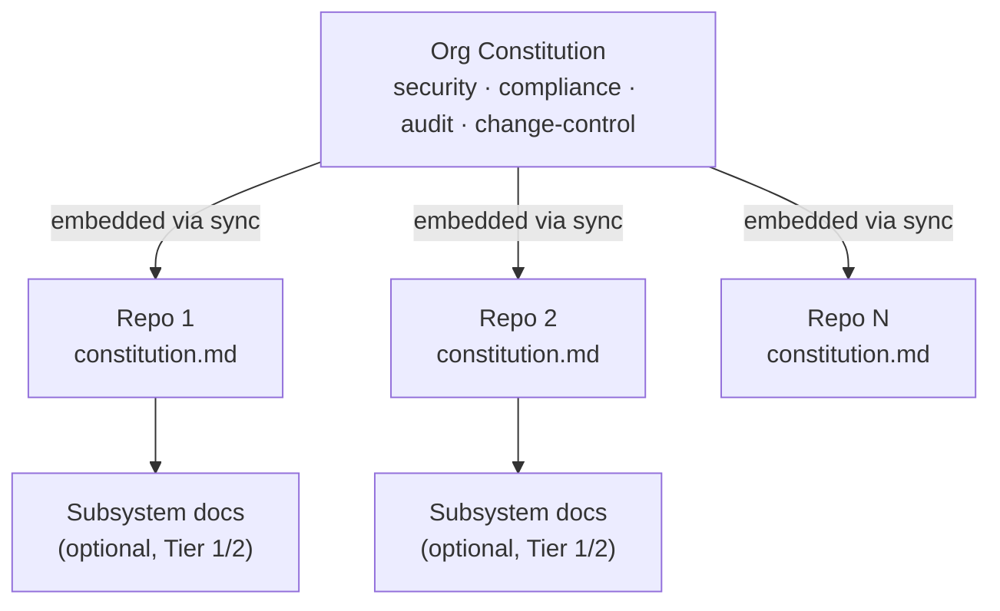
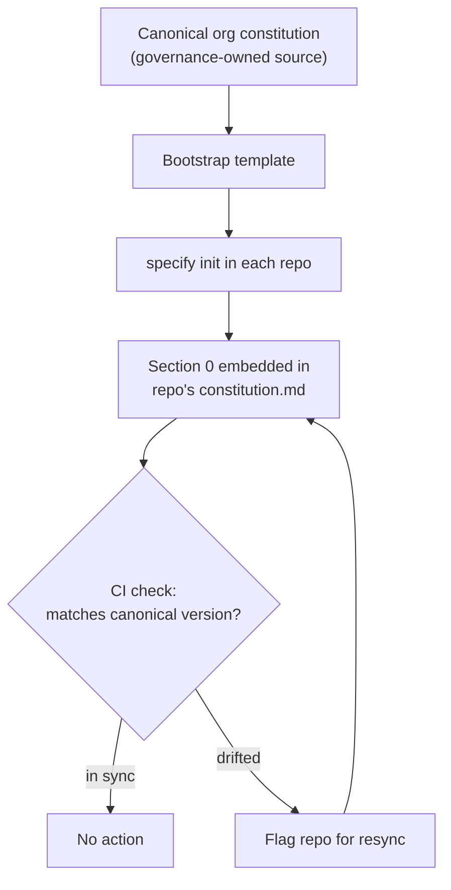
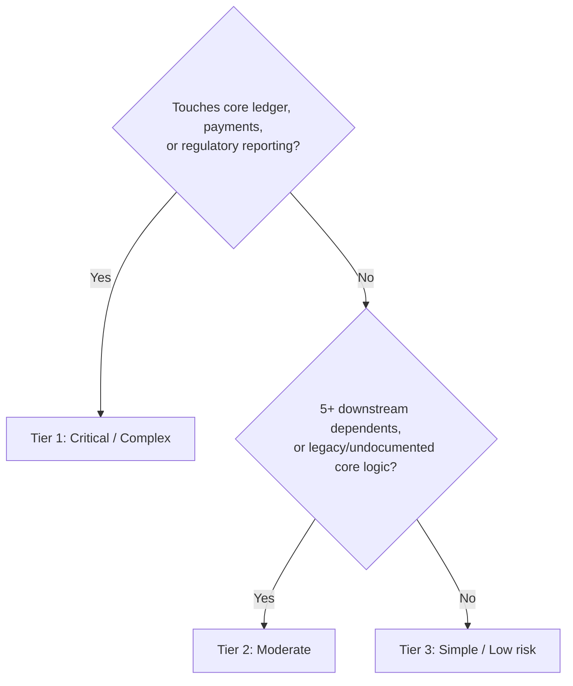
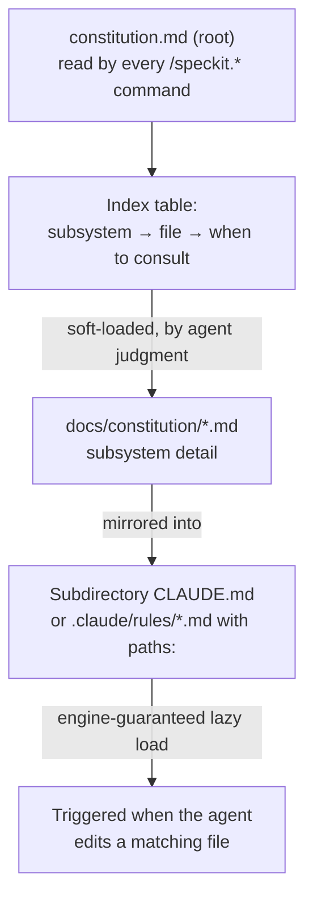

# A Lead Developer's Playbook for GitHub Spec Kit Across the Repo Estate

## How to use this playbook

Run `/speckit.constitution` cold, on a real codebase, and you get an OK-ish document — generic principles, no teeth. That's not a limitation of the tool. The command only fills its template from two sources: what you pass it as a prompt, and whatever it can infer from docs already sitting in your repo. It doesn't go digging. **The quality of your constitution is entirely a function of what you feed it — and how well you structure it afterward.**

This playbook exists because your hundreds of repos means tech leads making that judgment call independently, with wildly different budgets and risk profiles. It gives you a consistent model to work from: a two-layer structure (org rules + repo rules), a way to decide how much effort your specific repo deserves, and a pattern for keeping the resulting constitution small enough that an AI agent actually reads it properly.

Skip to what you need:

1. [Why the default constitution isn&#39;t enough](#1-why-the-default-constitution-isnt-enough)
2. [The two-layer model: org constitution + repo constitution](#2-the-two-layer-model-org-constitution--repo-constitution)
3. [Before you run the command: what to prepare](#3-before-you-run-the-command-what-to-prepare)
4. [Matching effort to risk: the three tiers](#4-matching-effort-to-risk-the-three-tiers)
5. [Keeping your constitution small: the conditional-loading pattern](#5-keeping-your-constitution-small-the-conditional-loading-pattern)
6. [Using /speckit.constitution correctly: create vs. update](#6-using-speckitconstitution-correctly-create-vs-update)
7. [Governance and amendment cadence](#7-governance-and-amendment-cadence)
8. [Quick-start checklist](#8-quick-start-checklist)
9. [Common pitfalls](#9-common-pitfalls)

---

## 1. Why the default constitution isn't enough

`/speckit.constitution` is a template-filler, not a researcher. It loads `.specify/memory/constitution.md`, finds placeholder tokens, and fills them from:

- Whatever you supply as arguments to the command, and
- Whatever it can infer from existing repo context — README, docs, prior constitution versions.

There's no third source. It won't go read your architecture diagrams on Confluence, interview your senior engineer, query that Understand-Anything graph, or infer that a shared copybook has forty dependents. If that information isn't in the repo or in your prompt, it doesn't exist as far as the command is concerned.

That has one important consequence for how you think about this: **the constitution isn't documentation written for humans — it's the operating contract every future `/speckit.plan`, `/speckit.tasks`, and `/speckit.implement` call reads before it touches your code.** A vague constitution produces vague plans that quietly drift from how your system actually works. A precise one — grounded in real facts about your codebase — makes every downstream command sharper, because the agent is reasoning from ground truth instead of guessing.

Your job as lead isn't to write a nicer-sounding document. It's to make sure the command has real facts to draw from before it runs.

---

## 2. The two-layer model: org constitution + repo constitution

Some rules should be identical across all your repos — they don't change because a repo happens to be written in TypeScript instead of C. Other rules are entirely repo-specific. Conflating the two produces either a bloated repo constitution nobody reads, or an org standard that never makes it into any individual repo. Split them.



**Org layer — owned centrally, changes rarely.** Regulatory and compliance non-negotiables, security baselines, mandatory audit logging, dual-control/change-approval requirements, data classification rules. These should be short — 10 to 20 lines applicable and tuned to your tech stack. If it's not something you'd escalate for a policy exception, it doesn't belong at this layer.

**Repo layer — owned by you and your team, changes often.** Real architecture facts, language/framework conventions, actual dependency data, ADRs specific to this system, do-not-touch zones. This is where the bulk of the useful, falsifiable detail lives.

**The sync problem.** Spec Kit has no native concept of a "parent" constitution — each repo's `/speckit.*` commands only ever read the local `.specify/memory/constitution.md`. So the org layer has to be physically present, word-for-word, inside every one of the 200 files. That means someone has to keep it in sync deliberately, or it silently drifts.



Practically: maintain the canonical org text in one governance-owned place, stamp it into every repo's constitution as a version-tagged "Section 0," and add a lightweight CI check that fails the build (or opens a ticket) if a repo's Section 0 doesn't match the current published version. This is a process you build, not a Spec Kit feature — but without it, the org layer is theater.

---

## 3. Before you run the command: what to prepare

Regardless of tier (more on tiers next), gather these before your first `/speckit.constitution` run. This is the actual lever — everything downstream depends on it.

| Prepare this                    | Why it matters                                                                                       | Format                                         |
| ------------------------------- | ---------------------------------------------------------------------------------------------------- | ---------------------------------------------- |
| Folder → purpose map           | Tells the agent where things live without it guessing from file names                                | Code block, exact paths                        |
| Hard rules per subsystem        | The falsifiable, decision-ready constraints the command needs to be useful                           | Table                                          |
| Existing ADRs                   | Captures *why* past decisions were made so the agent doesn't relitigate them                      | Bullet list                                    |
| Dependency / blast-radius facts | Real data on what breaks if a shared component changes                                               | Short reference doc, linked not pasted in full |
| Do-not-touch statements         | Explicit boundaries — e.g. "don't restructure existing classes; follow the pattern in`Services/`" | Bullets                                        |
| Regulatory scope for this repo  | Which compliance regimes apply here specifically (not the whole org's list)                          | Table                                          |

**Format matters more than it seems.** Tables and code blocks are measurably easier for an AI agent to parse reliably than prose — a table of rules doesn't get skimmed the way a paragraph does, and a code block signals "this is exact, don't paraphrase it." Use tables for rules and comparisons, code blocks for anything that must match exactly, bullets for ADRs and lists. Keep the constitution's own heading structure intact; add structure *inside* sections rather than reinventing the template shape.

One filter for every rule you're about to add: **if deleting it wouldn't change a single future plan or diff, it's decoration, not a rule.** Cut it.

---

## 4. Matching effort to risk: the three tiers

Not every repo deserves the same investment. A shared ledger service and an internal reporting script are not the same problem, and treating them identically either wastes budget or leaves your riskiest systems under-documented. Classify each repo into one of three tiers before you start.



| Tier                              | Criteria                                                                                                          | Recommended tooling                                                                                                                                                                                                 | Time investment                | Who's involved                                                        |
| --------------------------------- | ----------------------------------------------------------------------------------------------------------------- | ------------------------------------------------------------------------------------------------------------------------------------------------------------------------------------------------------------------- | ------------------------------ | --------------------------------------------------------------------- |
| **1 — Critical / Complex** | Core ledger, payments, regulatory reporting, or deep legacy/undocumented logic (mainframe, 15+ year old services) | Codebase knowledge-graph / domain-extraction tooling for modern languages, plus specialist static-analysis or business-rule-extraction tooling for legacy stacks; SME interviews to fill gaps the tools can't reach | Days, spread across one sprint | Lead dev + SME + one security/compliance reviewer before first commit |
| **2 — Moderate**           | Internal services with real cross-team dependents, moderate complexity                                            | A single knowledge-graph pass (scoped, not repo-wide) or careful manual context authoring                                                                                                                           | Half a day to a day            | Lead dev + one peer review                                            |
| **3 — Simple / Low risk**  | Small tools, scripts, isolated services, low blast radius                                                         | None — manual, template-driven checklist from Section 3                                                                                                                                                            | An hour or two                 | Lead dev, self-reviewed                                               |

Heavy tooling only pays for itself at Tier 1. Mandating it estate-wide either blows the budget or gets quietly ignored by teams running small internal tools — and using it on a Tier 1 legacy system without checking the tool actually supports that language is worse: you burn the budget and still ship an undocumented constitution for your riskiest repo. Match the investment to the risk, every time.

---

## 5. Keeping your constitution small: the conditional-loading pattern

A single 2,000-line constitution.md doesn't get read carefully — it gets skimmed, or worse, silently truncated in the agent's attention. The fix is structural: keep the root file thin, and push detail into files that only load when they're actually relevant.



Two things worth being precise about, because both are easy to get wrong:

**`@import` is not conditional loading.** It's static — anything you `@import` into `constitution.md` loads in full, every session, whether it's relevant to the current task or not. Using it to "organize" subsystem detail out of the root file doesn't save any context; it just moves the bloat one level down. Don't use it for this purpose.

**Real conditional loading happens two ways, and neither is a Spec Kit feature — both come from Claude Code's own memory engine, sitting alongside Spec Kit:**

- A **subdirectory `CLAUDE.md`** (e.g. `payments/CLAUDE.md`) only loads when the agent actually reads a file inside that folder — not at session start.
- A **path-scoped rule** in `.claude/rules/*.md` with a `paths:` glob in its frontmatter loads only when the agent touches a file matching that pattern — useful when languages are mixed across folders rather than cleanly separated.

The practical pattern: keep `constitution.md` thin (bank-wide non-negotiables plus an index table), keep the real subsystem detail in `docs/constitution/*.md`, and mirror that same detail into a subdirectory `CLAUDE.md` or path-scoped rule so it's *guaranteed* to load when the agent works in that area — not just loaded when it happens to consult the index. One caveat: subdirectory loading has had reliability issues in some Claude Code environments — verify yours actually fires (check `/memory`) before relying on it.

---

## 6. Using `/speckit.constitution` correctly: create vs. update

**Always use the command for both. Never hand-edit `constitution.md` directly.** The command does three things a manual edit skips entirely:

- Enforces semantic versioning (MAJOR/MINOR/PATCH) and writes a Sync Impact Report documenting exactly what changed
- Propagates the change to dependent templates (`plan`, `tasks`, `spec`) and flags any that need manual follow-up
- Refuses to touch anything outside the constitution file — no scope creep from a prompt that sneaks in a feature request

**First run — what to put in the prompt:**

```
Create the project constitution using the following as ground truth:

[paste your folder → purpose map, code block]
[paste your hard-rules table]
[paste your ADR list]
[paste or link your dependency/blast-radius summary]
[paste do-not-touch statements]
[paste this repo's regulatory scope]

Do not invent principles not supported by the above. Where a rule can't be
made falsifiable — where deleting it wouldn't change a future plan — omit it
rather than filling the placeholder with a generic statement.
```

**Amendments — what to put in the prompt:**

```
Amend the constitution: [principle] should change from [old] to [new].

Reason: [concrete incident, diff, or gap that prompted this]
Impact: [what this changes about how the agent should behave]
```

Feeding a concrete example — a diff that violated the old rule, an incident it should have prevented — is what lets the agent write something testable instead of another platitude.

---

## 7. Governance and amendment cadence

- **Quarterly compliance review** for every repo constitution: check for violations, either fix them or convert them into tracked technical debt.
- **Amendments go through a PR**, same as code: propose the change, justify it with a concrete example, get sign-off. Version bump and propagation happen automatically once the command runs.
- **Org-layer changes ripple down** through the sync/drift-check mechanism from Section 2 — a change to the canonical org constitution should trigger a resync flag across all 200 repos, not a silent divergence.

---

## 8. Quick-start checklist

1. Classify your repo into a tier (Section 4).
2. Gather context per the checklist in Section 3 — scaled to your tier's tooling budget.
3. Draft the org-layer Section 0 from the current canonical version (Section 2) — don't write it from memory.
4. Run `/speckit.constitution` with your prepared context as the prompt (Section 6).
5. Review the Sync Impact Report. Check every generated principle against the "would deleting this change a future plan?" test.
6. If Tier 1: route the draft through a security/compliance reviewer before committing.
7. If the constitution is large, split subsystem detail into `docs/constitution/*.md` and mirror into subdirectory `CLAUDE.md` or path-scoped rules (Section 5).
8. Commit. Set a calendar reminder for the quarterly review.

---

## 9. Common pitfalls

- **Running the command cold and expecting a good result.** It fills a template — it doesn't research your codebase for you.
- **Treating `@import` as free organization.** It loads everything, every time. It doesn't reduce context.
- **Hand-editing `constitution.md` directly.** You lose versioning, the Sync Impact Report, and template propagation — and nobody will notice until specs and the actual constitution have quietly diverged.
- **Applying Tier 1 tooling budget to a Tier 3 repo** (wasteful) **or Tier 3 effort to a Tier 1 repo** (dangerous). Match effort to risk deliberately, not by default.
- **Letting the org and repo layers drift.** Without the sync/drift check, "org non-negotiables" becomes a fiction within two quarters.
- **Writing principles that read well but decide nothing.** If it wouldn't change a plan or fail a review, it's decoration — cut it.
